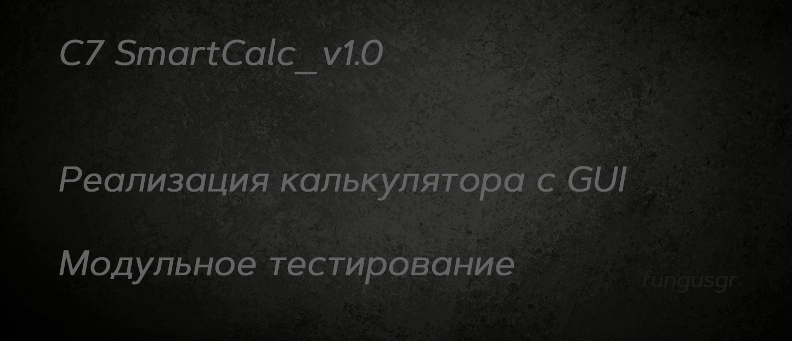
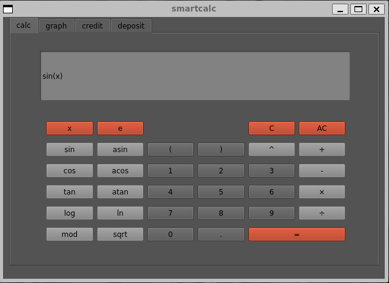
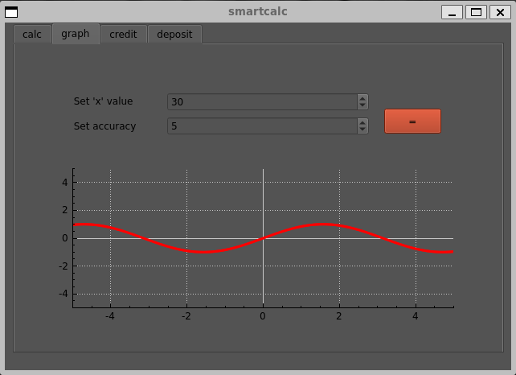
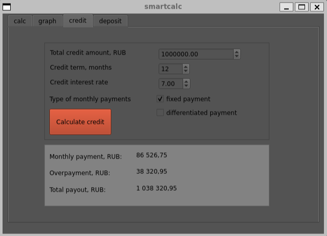
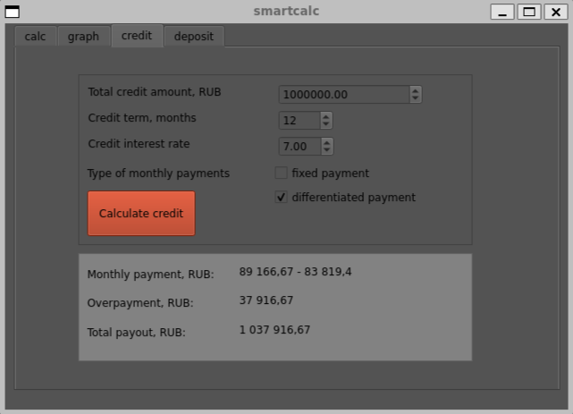
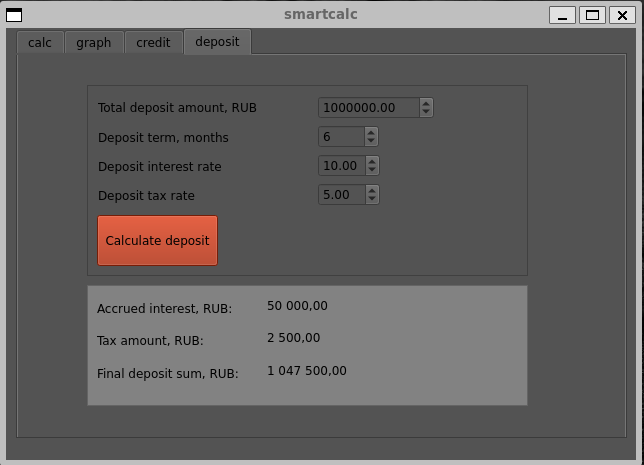
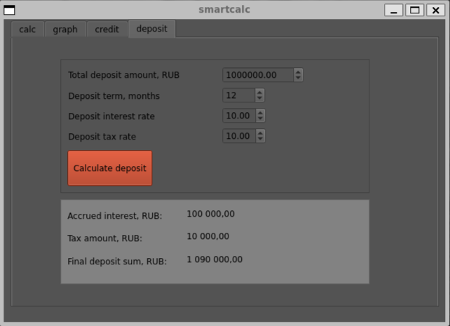

  


## Содержание C7_SmartCalc_v1.0  

* [Введение](#введение)
* [Основные команды make](#make)
* [Зависимости](#зависимости)  
* [Сборка](#сборка)  
* [Тесты](#тесты)  
* [Part 1: SmartCalc](#part-1-smartcalc)  
* [Part 2: Кредитный калькулятор](#part-2-кредитный-калькулятор)  
* [Part 3: Депозитный калькулятор](#part-3-депозитный-калькулятор)  
* [Part 4: Реализация цели dvi](#part-4-реализация-цели-dvi)  
* [Материалы, прочитанные и просмотренные, во время и для выполнения задания](#материалы-прочитанные-и-просмотренные-во-время-и-для-выполнения-задания)  

## Введение

Авторская реализация калькулятора с графическим интерфейсом      
Модульное тестирование    

### Реализованные требования к проекту C7_SmartCalc_v1.0

Разработано на языке C стандарта C11 и POSIX.1-2017 с использованием компилятора gcc  
Использовал дополнительные библиотеки и модули QT  
Реализация с графическим пользовательским интерфейсом на базе Qt     
Код библиотеки располагается в папке src в ветке develop  
Использован стиль разработки Google    
Программа разработана в соответствии с принципами структурного программирования     
Реализовано покрытие unit-тестами не менее 80% каждой функции программы c помощью Check   
Makefile с набором стандартных целей: `all`, `install`, `uninstall`, `clean`, `dvi`, `dist`, `test`, `gcov_report`  
В цели gcov_report формируется отчёт gcov в виде html страницы  
Проверяемая точность дробной части - 6 знаков после запятой  
Возможность ввода до 255 символов  

## Make  

### Основные команды
```
- make                сборка, тестирование и вывод отчёта
- make install        установить программу с возможностью выбора пути установки
- make uninstall      удалить программу и все установочные файлы
- make test           протестировать программу
- make dvi            собрать отчёт в dvi
- make dist           собрать дистрибутив программы
- make clean          удалить сборочные файлы
```

### Отчёт о покрытии 
``` 
- make gcov_report    собрать отчёт о покрытии
- make open_report    открыть отчёт о покрытии
```

### Проверки  
```
- make check        проверить зависимости
- make valgrind     проверить утечки и джампы
- make cpp          проверить с помощью cppcheck
- make style        проверить соответствие стилю Google
```

> Цель `dvi` в Make-файле используется для создания DVI-файлов из TeXinfo-документации.  
DVI-файлы являются промежуточным форматом, который затем может быть сконвертирован в другие форматы, такие как PDF или PostScript


> Цель `dist` используется для создания сжатого файла дистрибутива, который содержит все для установки, настройки и запуска программы на других машинах. Цель `dist` создает архив "s21_calc_v1.tar", в котором упакованы файлы программы, необходимые для ее установки и запуска на других машинах.  


## Зависимости  

***Для работы программы необходим фреймворк Qt***  
***Для работы цели dist необходима утилита TAR***  
***Для работы цели dvi необходимы утилиты Doxygen и Graphviz***  
***Для сборки отчёта о покрытии необходима установленная библиотека check + утилиты lcov и gcov***   

Проверка их наличия и установка осуществляется скриптами install_brew.sh и check_dependencies.sh командой `make check`  


<!--@cond PRIVATE-->
<details>
  <summary>Команды для ручной установки</summary>
  </p>

  | №  | Ресурс    | Команда Linux                      | Команда MacOs |
  |----|-----------|------------------------------------|----------------|
  | 1  | check.h:  | sudo apt install check             | brew install check |
  | 2  | lcov:     | sudo apt install lcov   	        | brew install lcov |
  | 3  | gcov:     | sudo apt install gcov              | xcode-select --install |
  | 4  | tar:      | sudo apt install tar               | brew install tar |
  | 5  | QT:       | sudo apt install qtbase5-dev       | brew install qt |
  | 6  | QT:       | sudo apt install qtchooser         | brew install qt |
  | 7  | QT:       | sudo apt install qt5-qmake         | brew install qt |
  | 8  | QT:       | sudo apt install qtbase5-dev-tools | brew install qt |
  | 9  | QT:       | sudo apt install libqt5charts5     | brew install qt |
  | 10 | QT:       | sudo apt install libqt5charts5-dev | brew install qt |
  | 11 | Doxygen:  | sudo apt install doxygen           | brew install doxygen |
  | 12 | GTK+:     | sudo apt install libgtk-3-dev      | brew install gtk+ |
  | 13 | Graphviz: | sudo apt install graphviz          | brew install graphviz |
  | 14 | QT:       | sudo apt install qt6-base-dev      | brew install qt |
  | 15 | QT:       | sudo apt install qtcreator         | brew install --cask qt-creator |

  Также возможно понадобится

  | № | Команда Linux                      | Команда MacOs  |
  |---|------------------------------------|----------------|
  | 1 | sudo apt-get update                | brew update    |
  | 2 | sudo apt-get install --fix-missing |                |

  Для установки Brew: `curl -fsSL https://rawgit.com/kube/42homebrew/master/install.sh | zsh`
</p>
</details> 
<!--@endcond-->  


### Использование

Для использования программы необходимо инсталлировать её, включая исходный код библиотеки и модульные тесты, с помощью Makefile.  


## Сборка

```
$ git clone  
$ cd C7_SmartCalc_v1.0-1
$ git switch develop  
$ cd src
$ make
```


## Тесты

Модульные и юнит-тесты реализованы при помощи библиотеки Check и утилиты gcov.  
Unit-тесты покрывают более 80% каждой функции.  
После отрабатывания всех тестов программа генерирует отчет gcov в форме html-страницы.  

После завершения работы программы с модульными тестами, проводится проверка на стиль и cppcheck. 


## Part 1. SmartCalc

Реализовал расширенную версию обычного калькулятора на Си.  
Помимо базовых арифметических операций, как плюс-минус и умножить-поделить, дополнил калькулятор:  
- возможностью вычисления арифметических выражений с учетом приоритетов
- возможность оперировать числами в экспоненциальной форме
- математическими функциями   

Помимо вычисления выражений калькулятор так же поддерживает использование переменной `x` и построение графика соответствующей функции.  

Скриншоты теста графика синуса с переменной `x` и заданной точностью   
   

<!--@cond PRIVATE-->   
<details>
  <summary>Как работать с интерфейсом программы</summary>
</p>
  
На вход программы могут подаваться целые и вещественные числа, записанные через точку    
Можно обрабатывать ввод чисел в экспоненциальной записи вида num/e/order    
Построение графика функции, заданной с помощью переменной _x_ с координатными осями и отметкой используемого масштаба     
Область определения и область значения функций ограничиваются по крайней мере числами от -1000000 до 1000000  
Для построения графиков функции необходимо дополнительно указывать отображаемые область определения и область значения  
Вычисления математических функций производятся в радианах   

**Кнопки**:

| Описание кнопки  | Кнопка |   
| ---------------- | ------- | 
| Переменная для функций | `x` | 
| Вычисляет косинус | `cos` |   
| Вычисляет синус | `sin` |  
| Вычисляет тангенс | `tan` |  
| Вычисляет арккосинус | `acos` | 
| Вычисляет арксинус | `asin` | 
| Вычисляет арктангенс | `atan` |
| Вычисляет квадратный корень | `sqrt` |
| Вычисляет натуральный логарифм | `ln` | 
| Вычисляет десятичный логарифм | `log` |
| Скобки для функций и приоритизации | `(` `)` |
| Для работы с экспоненциальным видом | `е` |
| Оператор взятия остатка от деления | `%` |
| Оператор возведения в степень | `^` |
| Оператор деления | `÷` |
| Оператор умножения | `×` |
| Оператор вычитания | `-` |
| Оператор сложения | `+` |
| Десятичная точка | `.` |
| Вычислить результат | `=` |
| Удалить символ | `C` |
| Очистить строку ввода | `AC` |

</p>
</details>
<!--@endcond-->  


## Part 2. Кредитный калькулятор

Кредитный калькулятор (за образец взял сайт calcus.ru):
 - Вход: общая сумма кредита, срок, процентная ставка, тип (аннуитетный, дифференцированный)
 - Выход: ежемесячный платеж, переплата по кредиту, общая выплата

<!--@cond PRIVATE-->   
<details>
  <summary>Скриншоты теста кредитного калькулятора</summary>
</p>
   
    

</p>
</details>
<!--@endcond-->  

## Part 3. Депозитный калькулятор

Депозитный калькулятор (за образец взял сайт banki.ru):
 - Вход: сумма вклада, срок размещения, процентная ставка, налоговая ставка
 - Выход: начисленные проценты, сумма налога, сумма на вкладе к концу срока

<!--@cond PRIVATE-->   
<details>
  <summary>Скриншоты теста депозитного калькулятора</summary>
</p>

   
 
 </p>
</details>
<!--@endcond-->  


## Part 4. Реализация цели dvi

> Doxyfile и Graphviz - это инструменты, которые помогают создавать документацию для проектов.  
> Doxyfile - это конфигурационный файл, который используется для настройки параметров генерации документации с помощью инструмента Doxygen.  

> Graphviz - это инструмент для создания диаграмм.  
> Он используется для отображения структуры проекта в виде диаграмм, таких как диаграммы классов, диаграммы наследования, диаграммы связей и другие.  
> Graphviz использует язык описания диаграмм DOT для описания структуры диаграммы и генерации графического представления.  

> Doxygen - это автоматический генератор документации.  
> Он автоматически создает документацию на основе комментариев в коде и предоставляет информацию о классах, функциях, переменных и других элементах кода.     
> Для формирования отчёта нужно комментировать код определённым образом:  
> - блочные комментарии: начинаются с `/**` и заканчиваются с `*/`, используются для доавления нескольких строк для описания элемента кода. 
> - инлайн-комментарии: начинаются с `///` и используются для документирования отдельных строк или для добавления дополнительной информации в блочные комментарии.  

И вот что в итоге получается  

  

## Материалы, прочитанные и просмотренные, во время и для выполнения задания  

   ### make
   [Стандартные цели в Make](https://www.opennet.ru/docs/RUS/coding_standard/standard-5.html#id_/html/body/h2[4]/a)  
   [Стандартные цели для пользователей GNU Make](https://runebook.dev/ru/docs/gnu_make/standard-targets)   

   ### dist
   [What is dist in Makefile?](https://alexott.net/ru/oss/automake/automake-ru_13.html)  
   [Средства обеспечения переносимости и распространения Makefile](https://studfile.net/preview/2620088/page:4/)  

   ### dvi
   [Документируем код эффективно при помощи Doxygen](https://habr.com/ru/articles/252101/)  
   [Doxygen awesome](https://jothepro.github.io/doxygen-awesome-css/index.html)  
   [Doxygen Habr](https://habr.com/ru/search/?target_type=posts&order=relevance&q=%5Bdoxygen%5D)  
   [DVI (TeX)](https://ru.wikipedia.org/wiki/DVI_(TeX))  

   ### gui
   [Заводим трактор: QMake](https://habr.com/ru/articles/577154/)  
   [GTK](https://ru.wikipedia.org/wiki/GTK)  
   [Qt](https://ru.wikipedia.org/wiki/Qt)  
   [ООП в картинках](https://habr.com/ru/articles/463125/)  
   [Уроки QT Creator](https://itproger.com/course/qt-creator)  
   [Установка фреймворка Qt и Qt Creator](https://metanit.com/cpp/qt/1.2.php)  
   [Qt учебник](https://learntutorials.net/ru/qt/topic/902/начало-работы-с-qt)  
   [Графики в Qt через QCustomPlot](https://harrix.dev/blog/2014/qcustomplot/)  
   [Руководство по Qt Creator](http://www.doc.crossplatform.ru/qtcreator/1.2.1/)  

💡 [Нажми сюда](https://forms.yandex.ru/cloud/6418155a6938722388a12878/)**, чтобы поделиться с нами обратной связью на этот проект**.  
Это анонимно и поможет команде Продукта сделать твоё обучение лучше.  
